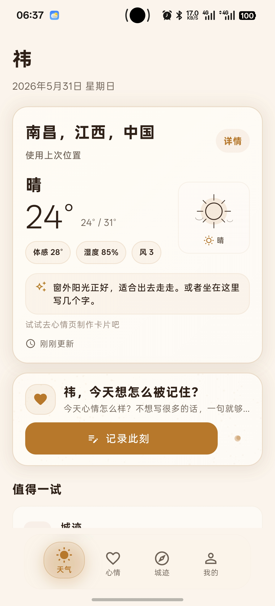
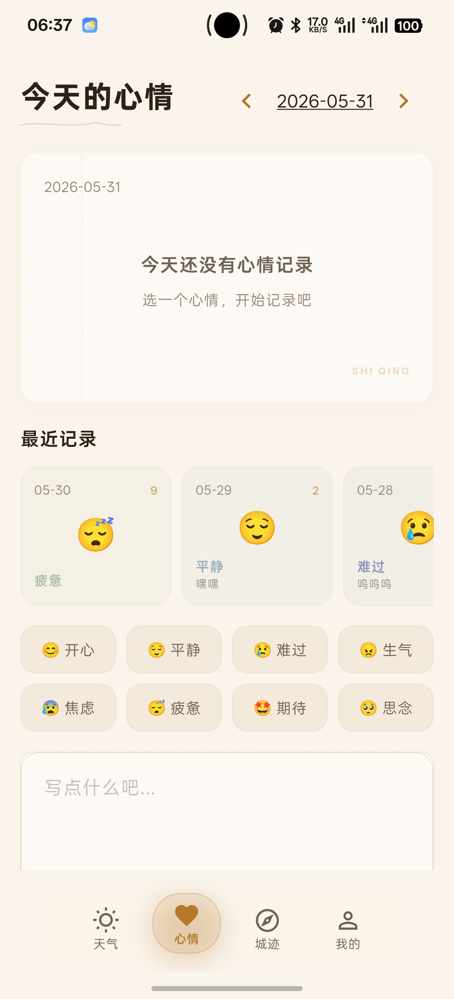
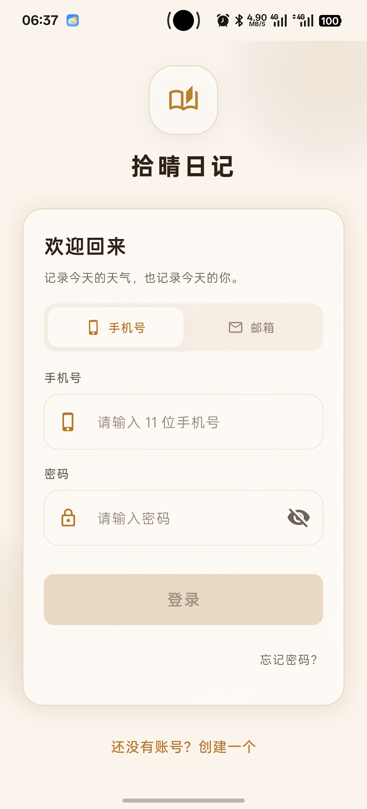
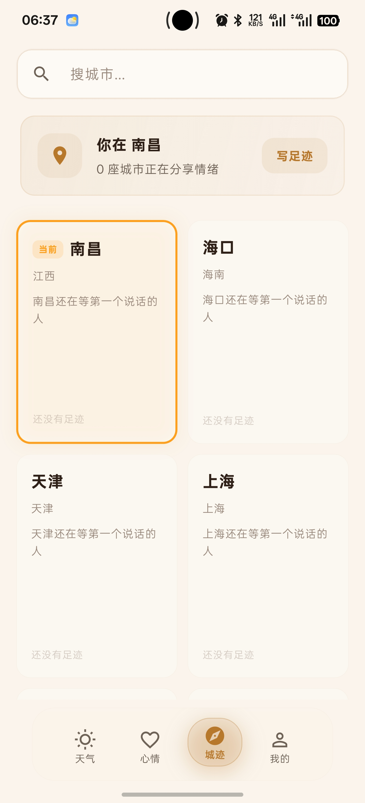
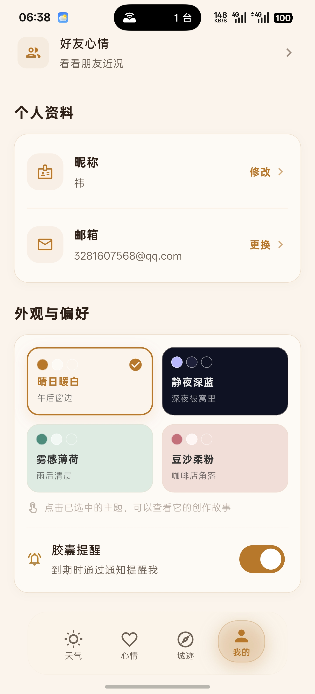

# 拾晴日记 软件操作手册

---

## 一、相关文档

| 文档名称 | 文档编号 | 说明 |
|---------|---------|------|
| 软件需求规格说明书 | XQRJ-SRS-001 | 描述拾晴日记全部功能需求与验收标准 |
| 概要设计说明书 | XQRJ-HLD-001 | 描述系统整体架构、模块划分与数据流 |
| 详细设计说明书 | XQRJ-LLD-001 | 各模块的接口定义、页面结构与交互细节 |
| 测试用例文档 | XQRJ-TC-001 | 覆盖注册登录、心情记录、卡片制作、时光胶囊等核心流程的测试用例 |
| 数据库设计文档 | XQRJ-DB-001 | 用户表、心情表、胶囊表、好友关系表等数据结构说明 |
| 用户协议与隐私政策 | XQRJ-LEGAL-001 | 用户服务条款、隐私数据收集范围与使用说明 |

【截图预留：请在此处插入相关文档清单截图】

---

## 二、软件说明

拾晴日记是一款面向个人用户的心情记录与天气生活应用，运行于 Android 平台。用户可以在每天打开应用时查看当前所在城市的实时天气状况，同时选择一种情绪来标记当天的心情，并用文字记录下此刻的想法。应用将天气与心情结合在一起，帮助用户在回顾时不仅看到某一天"热不热、下没下雨"，还能看到自己当时"开不开心、在想什么"。

本应用主要面向有日常记录习惯的年轻人，包括在校学生和刚步入职场的工作者。用户可以通过心情卡片功能将某一天的天气、情绪和文字组合成一张精美图片保存到手机相册，也可以分享给朋友。应用还提供了时光胶囊功能，用户可以写一段话封存起来，在设定的天数之后才能打开重新阅读，相当于给未来的自己写一封信。城迹足迹功能则展示了全国三百多个城市的情绪地图，用户可以浏览不同城市人们的心情，也可以在城市下方留言交流。

应用采用手机号注册登录，支持密码找回。登录后主界面分为四个标签页，分别是天气首页、心情记录、城迹足迹和个人中心。用户可以在个人中心修改昵称、更换头像、切换界面主题、管理好友关系，也可以查看签到连续天数。应用提供四种界面主题供用户选择，切换时带有平滑过渡动画，整体设计风格偏向纸质感和手绘笔触。

---

## 三、功能特点

天气首页展示用户当前城市的实时天气信息，包括温度、天气状况描述和更新时间。应用通过三种方式获取用户位置：优先读取上次保存的定位坐标，其次调用手机系统定位服务，最后通过网络地址推断大致城市。如果三种方式均未成功，界面会显示北京天气作为兜底。用户也可以在首页顶部点击搜索按钮手动输入城市名称进行切换，搜索框支持实时匹配，输入即出结果。

心情记录页面以四行两列的网格展示了八种情绪选项，分别是开心、平静、难过、生气、焦虑、疲惫、期待和思念，每种情绪配有专属的表情符号和主题色。用户点击某一种情绪后，页面下方会出现与该情绪对应的情景标签，比如选择"开心"会出现"被关心""达成目标""吃到了好吃的"等标签供用户勾选。文字输入区域采用横线信纸的视觉风格，光标为手写笔触，不同情绪还会显示不同的引导文字，例如选择难过时提示"没关系的，把它写下来吧"。

同一用户在同一天可以记录多条心情。页面顶部会展示"今天已记 N 条"的汇总区域，点击可以展开查看当天所有记录的时间和内容，也可以左右滑动删除某一条。最近七天的记录以横向滚动卡片的形式排列在情绪选择区上方，方便用户快速回顾近期的情绪变化。

心情卡片制作功能允许用户将一条心情记录转化为一张可保存的图片。卡片提供两种形状样式：温润风格带有圆角边框，方寸风格为直角方形。卡片背景色跟随当前选择的主题色，日期支持四种格式切换，分别为中文全称（2026年5月31日 星期六）、英文格式（May 31, 2026 Sat）、斜线格式（5/31）和点分格式（05.31）。卡片底部可设置水印文字，提供"拾晴日记""SHI QING""s q r j""小晴"四种选择。用户还可以在编辑面板中手动修改卡片上显示的情绪和标签，以及填写用户名显示在卡片上。完成编辑后点击保存按钮可将图片存入手机相册，也可以通过系统分享功能发送给微信好友或朋友圈。

时光胶囊功能让用户写一段不超过五百字的文字，选择一到三十天后打开。封存之后在到期之前无法查看内容，到期当天系统会通过本地通知提醒用户回来打开。胶囊页面提供了"测试通知"按钮，点击后一分钟内会收到一条推送，方便用户确认通知权限已正确开启。如果通知未能收到，页面会弹出各品牌手机的通知设置引导，覆盖了华为、小米、OPPO、vivo等常见品牌的操作步骤。

城迹足迹页面展示了一张中国地图，上面标注了三百多个城市的位置。每个城市旁边显示该城市收到的心情评论数量。用户点击某个城市后会弹出底部面板，显示该城市的评论列表，也可以输入文字留下自己的心情留言。点击评论面板中城市名称旁的图标可以展开城市介绍卡片，了解这座城市的基本信息。已留言的城市在地图上会以不同颜色高亮区分。

好友互动功能通过手机号搜索添加好友，好友关系设有七天有效期，过期后需要重新授权。添加成功后，用户可以查看好友当前的心情状态和最近的记录。个人中心页面顶部展示了用户的连续签到天数，每日轻点签到区域即可完成签到。签到区域下方是好友管理入口，可以查看好友列表和待处理的好友请求。

---

## 四、系统要求

本应用运行在 Android 操作系统的手机上，要求 Android 系统版本为 7.0 及以上，处理器架构为 arm64。手机需要至少有一百兆字节的可用存储空间用于安装应用和缓存天气数据及城市信息。应用运行过程中需要网络连接用于同步天气数据、心情记录和好友信息，在没有网络的环境下本地缓存的天气数据仍可展示，但心情记录的保存和加载需要网络支持。

应用在首次使用时会申请位置信息权限，用于自动获取当前城市天气。如果用户拒绝授权，可以手动搜索城市来查看天气。应用还会申请通知权限，用于在时光胶囊到期时发送提醒。如果用户不开启通知权限，胶囊到期后需要手动进入胶囊页面查看。本地存储权限用于将心情卡片图片保存到手机相册。

---

## 五、用户注册与登录

首次打开应用时会进入引导流程，介绍应用的核心功能。引导结束后显示登录页面，用户输入手机号和密码即可登录。如果尚未注册，点击登录页面下方的"注册"链接跳转到注册页面。注册时需要输入手机号、设置密码并确认密码，阅读并勾选用户协议和隐私政策后点击注册按钮完成账号创建。

如果用户忘记了密码，在登录页面点击"忘记密码"链接进入密码重置页面。重置密码需要输入注册时使用的手机号，系统会验证该手机号是否已注册，验证通过后用户可以设置新密码。新密码设置完成后自动返回登录页面，用户使用新密码登录即可。

登录成功后进入应用主界面，底部导航栏分为四个标签页：天气、心情、城迹、我的。用户的登录状态会被保存在本地，下次打开应用时无需重复登录。如果用户在其他设备上修改了密码，当前设备的登录状态会失效，需要重新输入密码登录。

【截图预留：请在此处插入登录页面截图】

【截图预留：请在此处插入注册页面截图】

---

## 六、天气首页

天气首页是应用打开后默认展示的页面。页面顶部左侧显示用户昵称和当前日期，右侧显示天气概况卡片。天气卡片展示了当前城市的名称、实时温度、天气状况（如晴、多云、小雨等）以及数据更新时间。卡片右下角有"查看详情"入口，点击后进入天气详情页面，可以看到更完整的气象信息。如果天气数据正在后台更新，卡片顶部会显示"正在更新"的提示文字，更新完成后提示自动消失。

用户可以通过两种方式切换城市。第一种是在天气卡片下方点击城市名称旁的搜索图标，弹出搜索框后输入城市名称，从匹配结果中选择目标城市，页面会自动刷新该城市的天气。第二种是下拉页面触发刷新操作，应用会重新定位当前位置并更新天气数据。定位状态会在卡片左下方以小字显示，如"GPS定位""IP定位"或"使用上次位置"。

天气卡片下方是心情引导区域，显示"某某，今天想怎么被记住？"的问候语和一个"记录此刻"按钮。点击该按钮会跳转到心情记录页面。引导区域下方是"值得一试"板块，列出了两个快捷入口：城迹和胶囊，分别跳转到城迹足迹页面和时光胶囊页面。如果用户使用的是最新版本，首次保存心情后会收到"试试把心情制成卡片分享给朋友吧"的提示。

【截图预留：请在此处插入天气首页截图】

---

## 七、心情记录

心情记录页面顶部显示"今天的心情"标题和日期导航。用户可以通过左右箭头切换查看前后日期的记录，也可以点击日期文字弹出日历选择器跳转到指定日期。日历的可选范围从2020年1月到当天，不支持选择未来日期。

页面中部以四列两行的网格排列了八种情绪选项。每种情绪显示表情符号和中文名称，点击后该情绪卡片会放大并高亮显示，同时下方出现对应的情景标签。以"开心"为例，可选标签包括"被关心""达成目标""吃到了好吃的""收到礼物""天气好""久别重逢""莫名开心""被夸奖"。标签支持多选，选中的标签会以主题色高亮。再次点击已选中的情绪可以取消选择。

文字输入区域采用信纸风格，显示横向线条和左侧页边距。不同情绪下输入框会显示不同的提示文字，选择"期待"时提示"在期待什么呢？分享一下吧"，选择"思念"时提示"想TA了就说出来吧"。每种情绪的输入内容是独立保存的，切换情绪再切回来之前输入的文字不会丢失。页面底部的保存栏显示当前状态，有改动时显示"有改动未保存"并提供保存按钮，保存成功后显示"已保存"并出现"制作卡片"入口。支持左滑删除某一条历史记录，删除后底部会弹出撤销提示，四秒内可以点击撤销恢复。

【截图预留：请在此处插入心情记录页面截图】

---

## 八、心情卡片制作

在心情记录页面保存心情后，底部栏会出现"制作卡片"按钮，点击后从底部弹出卡片制作面板。面板上方是卡片预览区域，实时展示当前样式的卡片效果。下方是编辑面板，点击"编辑"按钮后展开全部自定义选项。

卡片形状有两种选择：温润风格带有柔和的圆角边框，方寸风格为规整的直角方形。背景色跟随四种主题色变化，晴日暖白主题为米黄色底配棕色强调色，静夜深蓝主题为深蓝底配浅紫强调色，雾感薄荷主题为浅绿底配墨绿强调色，豆沙柔粉主题为淡粉底配玫瑰红强调色。日期格式可以在中文全称、英文格式、斜线格式和点分格式之间切换。水印文字可在"拾晴日记""SHI QING""s q r j""小晴"四种选择中切换，也可以选择不显示水印。

编辑面板还支持修改卡片上显示的情绪和标签。点击"情绪"行可以展开表情选择器，从八种情绪中重新选择。点击"标签"行可以展开标签选择器，提供"达成目标""运动健身""美食享受""朋友聚会"等十五个常用标签供勾选。用户名输入框为可选项，填写后会在卡片底部显示用户昵称。完成所有编辑后，点击面板底部的"保存到相册"按钮，卡片图片会保存到手机的图片库中。也可以点击"分享"按钮，通过系统分享菜单将图片发送给微信、QQ等应用中的联系人。

【截图预留：请在此处插入卡片制作编辑面板截图】

---

## 九、时光胶囊

时光胶囊入口位于天气首页"值得一试"板块中，也可以通过底部导航栏进入。胶囊页面顶部是一张创建卡片，标题为"写给未来的自己"，下方有一个多行文本输入框，最多可输入五百字。输入框下方是时间选择区域，用户可以通过滑动条在1天到30天之间选择胶囊的封存时长，也可以点击"1天""3天""7天""14天""30天"的快捷按钮直接设定。滑动条右侧会显示预计打开的日期。

点击"确认封存"按钮后，胶囊会被封存到服务器，同时在手机本地注册一条定时通知。封存成功后页面会弹出通知设置引导面板，帮助用户确认手机的通知权限已正确开启。引导面板覆盖了华为、小米、OPPO、vivo等主流品牌，左右滑动可以切换查看不同品牌的设置步骤。面板底部提供"测试通知"按钮，点击后一分钟内会收到一条推送通知，方便用户验证通知是否正常工作。

胶囊列表区域以时间线形式展示所有已创建的胶囊。每颗胶囊卡片显示封存日期、剩余天数和当前状态。未到期的胶囊显示"几月几日可打开"和剩余天数，到期的胶囊显示"可以打开了"并带有高亮边框，已打开的胶囊显示"已打开"。点击到期胶囊后会弹出底部面板展示胶囊内容，标题为"来自过去的自己"，下方显示封存时写的文字和封存日期。已打开的胶囊可以通过右侧的删除按钮移除。

【截图预留：请在此处插入时光胶囊创建页面截图】

【截图预留：请在此处插入胶囊打开内容页面截图】

---

## 十、城迹足迹

城迹足迹页面以地图形式展示了全国三百多个城市的情绪分布。每个城市在地图上以圆点标注，圆点旁边显示该城市收到的评论数量。页面顶部提供搜索框，输入城市名称或省份名称可以快速筛选目标城市。搜索框下方有统计信息，显示当前活跃城市总数和评论总数。

地图上的城市分为"有留言的城市"和"还没有留言的城市"两个分组。有留言的城市按照评论数量从多到少排列在前面，并以主题色高亮标注。用户自己留言过的城市也会以不同颜色标记。没有留言的城市默认折叠在列表下方，点击"展开"可以查看完整列表。

点击任意城市后会从底部弹出评论面板，显示该城市的所有留言。每条留言包含用户头像、留言内容和发布时间，自己发布的留言可以左滑删除。面板底部有输入框，用户可以输入文字后点击发送按钮在该城市留下一条心情留言。在评论面板中，城市名称旁边有一个信息图标，点击后会弹出城市介绍卡片，展示该城市的地理位置、气候特征、文化特色等基本信息。

【截图预留：请在此处插入城迹足迹地图页面截图】

---

## 十一、好友互动

好友功能入口在个人中心页面。点击"好友"选项进入好友管理页面，页面分为"好友列表"和"好友请求"两个区域。添加好友的方式是输入对方的手机号进行搜索，搜索到对方后点击"添加"发送好友请求。对方在自己的好友请求列表中看到请求后可以选择同意或拒绝。好友关系设为七天有效期，过期后双方的好友关系自动解除，如需继续保持需要重新发送请求。

添加好友成功后，用户可以在好友列表中看到好友的昵称和当前心情状态。点击某个好友可以查看对方最近的心情记录，了解好友的情绪变化。好友列表支持下拉刷新，及时获取最新的好友心情数据。如果收到新的好友请求，页面顶部会显示待处理请求数量的红点提示。

【截图预留：请在此处插入好友列表页面截图】

---

## 十二、个人中心与设置

个人中心页面顶部展示用户头像、昵称和手机号。头像支持从手机相册中选择图片更换。昵称可以点击编辑，修改后保存到服务器。昵称下方显示签到区域，展示当前连续签到天数，每日轻点该区域即可完成签到，签到后区域变为"连续 N 天"的显示状态。

签到区域下方是功能入口列表。"好友"入口跳转到好友管理页面。"时光胶囊"入口跳转到胶囊页面。"主题"选项可以切换应用的界面主题，提供四种选择：晴日暖白为默认的暖色调浅色主题，静夜深蓝为深色护眼主题，雾感薄荷为清新的绿色调主题，豆沙柔粉为柔和的粉色调主题。切换主题时整个界面会以平滑动画过渡到新主题的配色方案。

设置区域包含"修改密码"选项，用户输入旧密码和新密码即可完成密码更新。"通知开关"用于控制时光胶囊到期提醒的推送通知是否开启。页面下方是"关于拾晴日记"入口，进入后可以看到应用版本号、开源仓库地址、MIT开源许可证全文、ICP备案号（赣ICP备2026009414号-3A）、隐私政策、用户协议、权限说明和国标合规声明。关于页面还提供了意见反馈入口，用户可以输入不超过一千字的建议或问题，提交后发送到开发团队。

【截图预留：请在此处插入个人中心页面截图】

【截图预留：请在此处插入主题切换页面截图】

---

## 十三、常见问题解答

问：定位失败怎么办？答：如果天气首页显示"定位失败"，可以点击天气卡片上的搜索图标手动输入城市名称。也可以检查手机的定位服务是否已开启，以及是否授予了拾晴日记位置信息权限。在手机的系统设置中找到"应用管理"，进入拾晴日记的权限页面，确认位置权限已设置为"允许"。

问：心情保存失败怎么办？答：保存心情需要网络连接，请确认手机当前可以正常上网。如果网络正常但仍保存失败，可以下拉心情页面刷新后重试。连续多次失败时建议关闭应用后重新打开。

问：时光胶囊到期了但没收到通知怎么办？答：请在个人中心确认通知开关已开启。如果开关已开启但仍未收到通知，进入手机系统设置中的通知管理页面，找到拾晴日记并确认通知权限已允许。部分手机品牌需要额外开启自启动权限和关闭电池优化，可以在胶囊页面的"测试通知"功能中查看对应品牌的设置指引。

问：如何删除已经保存的心情记录？答：在心情记录页面的"今天已记 N 条"区域展开当天所有记录，左滑某一条记录会出现删除按钮。在最近七天的记录卡片中点击某一天，在弹出的详情面板中也可以左滑删除单条记录。删除操作支持四秒内撤销。

问：好友关系过期了怎么办？答：好友关系的有效期为七天。过期后对方会从好友列表中消失，如果希望继续保持好友关系，需要重新通过手机号搜索对方并发送好友请求。

问：心情卡片保存后在哪里找？答：保存的心情卡片会存入手机的相册应用中，通常在"拾晴日记"或"所有照片"相册文件夹中可以找到。如果保存时提示权限不足，请在系统设置中授予拾晴日记存储权限。

---

## 十四、术语表

心情卡片：指将某一天的天气信息、情绪标签和文字记录组合生成的一张图片，用户可以保存到手机或分享给他人。卡片有温润和方寸两种形状，支持自定义日期格式、水印和背景主题色。

时光胶囊：指用户撰写的一段文字内容，在设定的到期时间之前处于封存状态，到期后才能打开查看。胶囊的封存时长为一到三十天，到期时通过手机通知提醒用户。

城迹足迹：指应用中的城市情绪地图功能，展示全国三百多个城市的情绪评论分布。用户可以在任意城市下留言，留言过的城市会在地图上高亮标记。

连续签到：指用户每天在个人中心完成一次签操作后累计的天数。只要每天签到一次，连续天数就会累加，中断一天后连续天数重新计算。

情景标签：指选择心情后出现的描述具体情景的标签选项。例如选择"开心"后会出现"被关心""达成目标"等标签，用于补充说明产生该情绪的具体原因。

好友授权：指通过手机号添加好友的机制。好友关系设有七天有效期，过期后自动解除。这是为了保护用户隐私，确保好友之间的查看权限定期刷新。

界面主题：指应用提供的四种全局配色方案。晴日暖白为暖黄色调浅色主题，静夜深蓝为深色主题，雾感薄荷为浅绿色调主题，豆沙柔粉为淡粉色调主题。切换主题后所有页面的颜色、文字和背景都会同步变化。

水印文字：指心情卡片底部显示的标识性文字。提供"拾晴日记""SHI QING""s q r j""小晴"四个选项，用于在分享卡片时标注来源。
